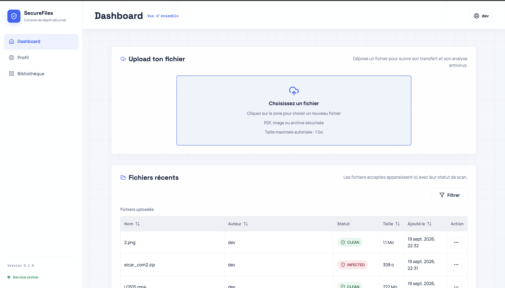
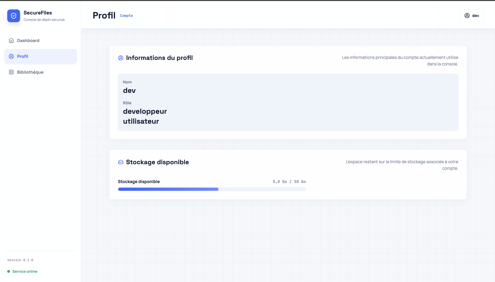
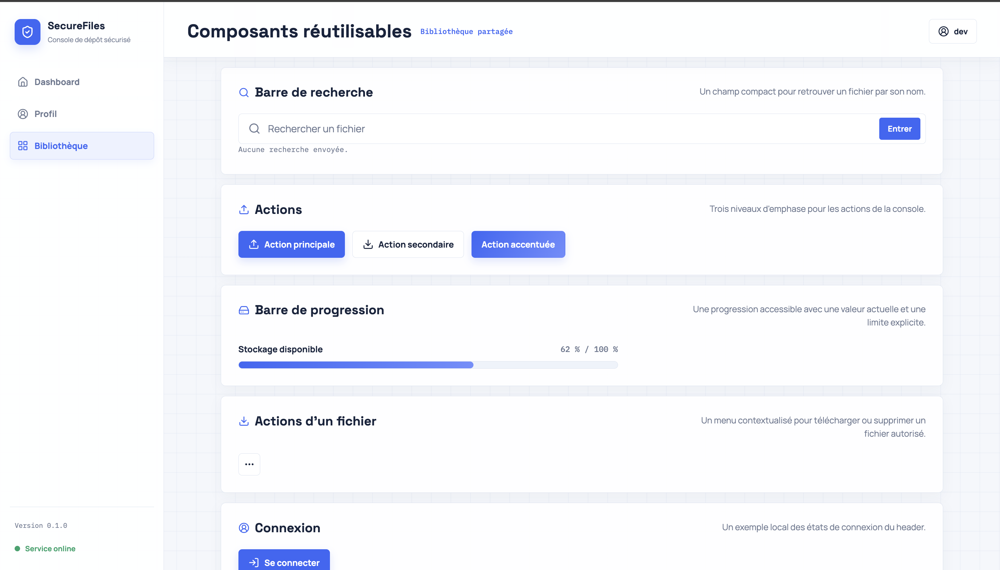
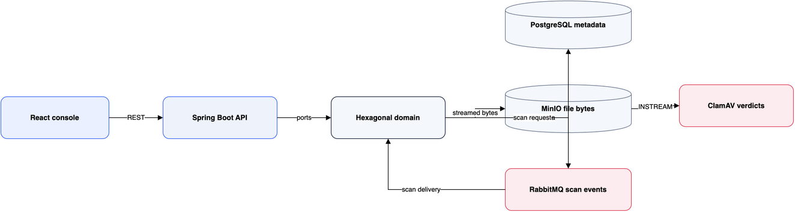
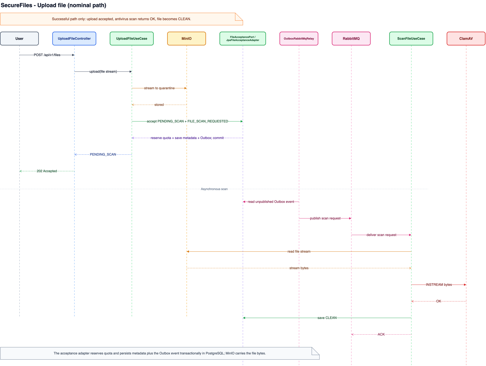
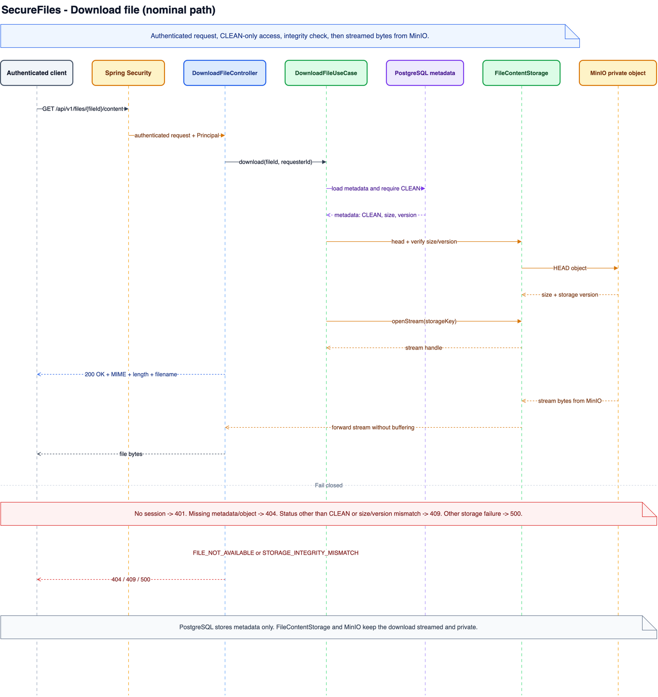
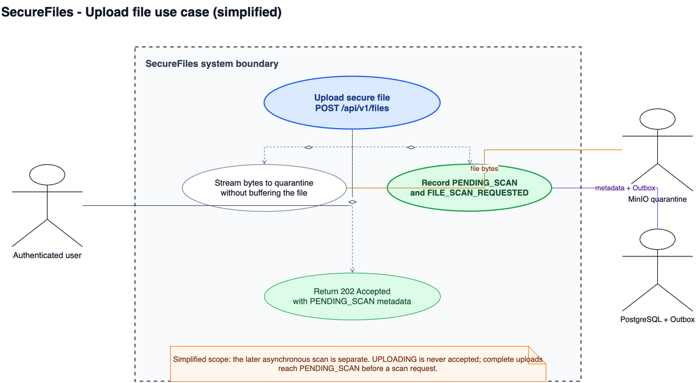
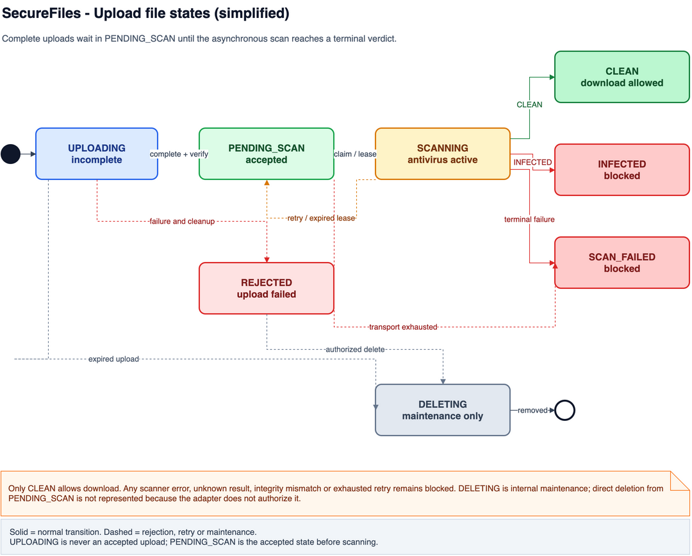
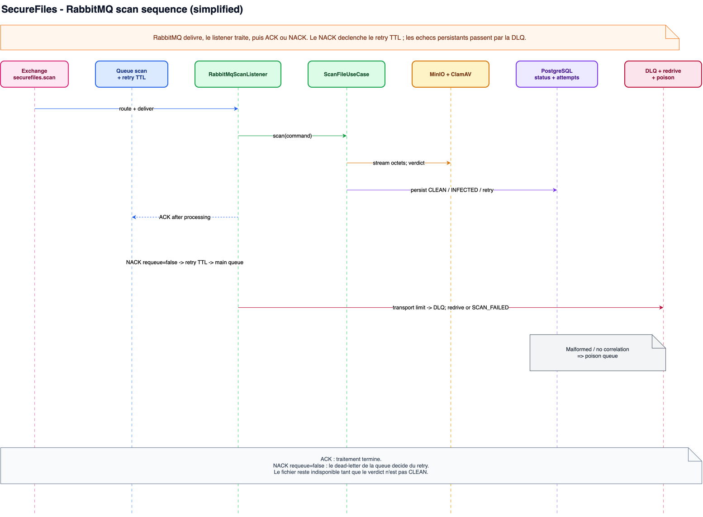
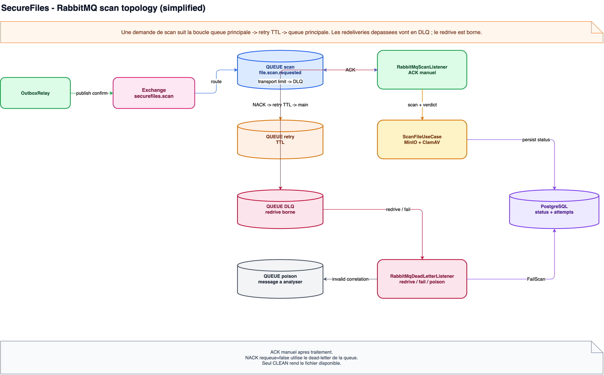

# SecureFiles

Micro-service de depot et de distribution de fichiers securises, realise pour un exercice Java / Spring Boot / React / PostgreSQL.

## Présentation rapide de la console

Les trois vues suivantes présentent rapidement les principaux parcours de la console SecureFiles.

### 1. Dashboard



Le Dashboard centralise le dépôt d'un fichier, le suivi de son analyse antivirus et la liste des fichiers récents avec leur statut.

### 2. Profil



La page Profil expose l'identité et les rôles du compte, ainsi que la progression de son quota de stockage.

### 3. Bibliothèque



La Bibliothèque présente les composants partagés de la console : recherche, actions, progression, menu d'action d'un fichier et états de connexion.

## Vue d'ensemble

SecureFiles combine :

- une API Spring Boot 3.5 / Java 21 ;
- une console React 19 / TypeScript / Vite ;
- PostgreSQL pour les metadonnees et Liquibase pour le schema ;
- MinIO pour les octets, RabbitMQ pour le traitement asynchrone et ClamAV pour l'analyse.

La console propose un Dashboard d'upload et de suivi, un Profil avec le quota de stockage et
une Bibliotheque de composants reservee aux profils contenant le role `developpeur`.

## Fonctionnement sécurisé

Un fichier suit ce cycle :

```text
UPLOADING -> PENDING_SCAN -> SCANNING -> CLEAN
                                      -> INFECTED
                                      -> SCAN_FAILED
UPLOADING -> REJECTED
```

- Un upload accepte renvoie `202 Accepted` en `PENDING_SCAN`.
- Seul `CLEAN` autorise le téléchargement pour un utilisateur authentifie.
- Une panne, une reponse inconnue ou un timeout de ClamAV reste bloquant.
- Les octets transitent en flux et restent hors de PostgreSQL ; la base conserve les metadonnees,
  les statuts, les tentatives et les evenements Outbox.
- `DELETING` est un statut interne de maintenance, exclu des listes et des telechargements.

## Structure

```text
SecureFiles/
├── backend/                 # API, domaine, adaptateurs et tests Maven
├── frontend/                # console React, composants et tests Vitest
├── docs/diagrams/            # sources draw.io et aperçus PNG
├── docs/features/            # historique des features
├── docs/screenshots/         # captures de la console utilisées par ce README
├── rules/                    # règles de code, de test et d'UX/UI
├── docker-compose.yml        # PostgreSQL, MinIO, RabbitMQ et ClamAV
├── Makefile                  # initialisation et lancement local
└── README.md
```

## Diagrammes

Les diagrammes editables sont des sources XML draw.io rangees par categorie. Chaque vue detaillee possede une vue `-simplified` correspondante ; Mermaid et Excalidraw sont conserves uniquement comme brouillons ou archives.

| Sujet | Apercus PNG | Source editable |
| --- | --- | --- |
| SecureFiles architecture | [](docs/diagrams/architecture/system/securefiles/architecture-simplified.drawio) | [draw.io](docs/diagrams/architecture/system/securefiles/architecture-simplified.drawio) |
| Upload secure file | [](docs/diagrams/sequence/feature/file-upload/upload-file-sequence-simplified.drawio) · [detailed PNG](docs/diagrams/sequence/feature/file-upload/renders/upload-file-sequence.png) | [simplified draw.io](docs/diagrams/sequence/feature/file-upload/upload-file-sequence-simplified.drawio) · [detailed draw.io](docs/diagrams/sequence/feature/file-upload/upload-file-sequence.drawio) |
| Download secure file | [](docs/diagrams/sequence/feature/file-download/download-file-sequence-simplified.drawio) · [detailed PNG](docs/diagrams/sequence/feature/file-download/renders/download-file-sequence.png) | [simplified draw.io](docs/diagrams/sequence/feature/file-download/download-file-sequence-simplified.drawio) · [detailed draw.io](docs/diagrams/sequence/feature/file-download/download-file-sequence.drawio) |
| Upload use case | [](docs/diagrams/use_case/feature/file-upload/upload-file-simplified.drawio) | [draw.io](docs/diagrams/use_case/feature/file-upload/upload-file-simplified.drawio) |
| Upload file states | [](docs/diagrams/use_case/feature/file-upload/upload-file-states-simplified.drawio) · [detailed PNG](docs/diagrams/use_case/feature/file-upload/renders/upload-file-states.png) | [simplified draw.io](docs/diagrams/use_case/feature/file-upload/upload-file-states-simplified.drawio) · [detailed draw.io](docs/diagrams/use_case/feature/file-upload/upload-file-states.drawio) |
| RabbitMQ scan sequence | [](docs/diagrams/sequence/logic/rabbitmq-scan/rabbitmq-scan-sequence-simplified.drawio) · [detailed PNG](docs/diagrams/sequence/logic/rabbitmq-scan/renders/rabbitmq-scan-sequence.png) | [simplified draw.io](docs/diagrams/sequence/logic/rabbitmq-scan/rabbitmq-scan-sequence-simplified.drawio) · [detailed draw.io](docs/diagrams/sequence/logic/rabbitmq-scan/rabbitmq-scan-sequence.drawio) |
| RabbitMQ scan topology | [](docs/diagrams/component/logic/rabbitmq-scan/rabbitmq-scan-topology-simplified.drawio) · [detailed PNG](docs/diagrams/component/logic/rabbitmq-scan/renders/rabbitmq-scan-topology.png) | [simplified draw.io](docs/diagrams/component/logic/rabbitmq-scan/rabbitmq-scan-topology-simplified.drawio) · [detailed draw.io](docs/diagrams/component/logic/rabbitmq-scan/rabbitmq-scan-topology.drawio) |

Pour regenerer les apercus, installer ou fournir le binaire draw.io desktop puis lancer `DRAWIO_BIN=/path/to/drawio make diagrams-export`. Ajouter `DIAGRAM_EXPORT_JPG=1` pour produire aussi les JPG.

## API HTTP

L'API est disponible sur `http://localhost:8080` en local. Les routes mutantes utilisent le
cookie HttpOnly `SECUREFILES_AUTH`; le profil `prod` ajoute la protection CSRF.

| Route | Accès | Comportement principal |
| --- | --- | --- |
| `GET /actuator/health` | Public | Retourne l'état technique du service. |
| `POST /api/v1/auth/register` | Public | Crée un compte (`201`), avec les rôles `developpeur` et `utilisateur`. |
| `POST /api/v1/auth/login` | Public | Ouvre une session JWT de 30 jours et pose le cookie HttpOnly. |
| `POST /api/v1/auth/logout` | Session facultative | Révoque la session courante et efface le cookie (`204`). |
| `GET /api/v1/auth/csrf` | Public | Initialise le cookie CSRF en production (`204`). |
| `GET /api/v1/users/me` | Public | Retourne le profil ou `204` sans session. |
| `GET /api/v1/users/me/storage` | Authentifié | Retourne le quota utilisé et total (`401` sans session). |
| `GET /api/v1/files/config` | Public | Retourne la taille maximale d'upload. |
| `GET /api/v1/files` | Public | Retourne la page publique des metadonnees de fichiers. |
| `POST /api/v1/files` | Authentifié | Reçoit `file` en multipart et retourne `202/PENDING_SCAN`. |
| `GET /api/v1/files/{id}` | Propriétaire | Retourne les metadonnees et le statut du fichier. |
| `GET /api/v1/files/{id}/content` | Authentifié | Streame uniquement un fichier `CLEAN` (`409` sinon). |
| `DELETE /api/v1/files/{id}` | Propriétaire ou admin | Supprime le fichier (`204`) si son statut le permet. |

La liste accepte `page`, `size`, `sort`, `direction` et `status` :

```text
GET /api/v1/files?page=1&size=10&sort=createdAt&direction=desc&status=CLEAN
```

`size` est limité à `50`, l'offset à `10 000`, et les tris autorisés sont `name`, `author`,
`size` et `createdAt`. Les statuts peuvent être répétés ou séparés par des virgules ;
`DELETING` reste interne. La réponse contient `content`, `page`, `size`, `totalElements`,
`totalPages`, `hasNext` et `hasPrevious`, sans octets, hash ni clé de stockage.

Les capacités `canDownload` et `canDelete` sont indicatives pour la console ; le backend
réapplique toujours l'autorisation dans les cas d'utilisation. Les erreurs de taille,
pagination et disponibilité utilisent des codes stables comme `MAX_SIZE_EXCEEDED`,
`INVALID_PAGINATION`, `INVALID_LIST_QUERY` et `FILE_NOT_AVAILABLE`.

## Démarrage local

Prérequis : Java 21, Maven 3.9+, Node.js 22+, Docker Desktop et Docker Compose.
Sur Apple Silicon, ClamAV utilise l'image `linux/amd64` via l'émulation Docker.

Depuis la racine :

```bash
make init-env
make init
```

`make init-env` crée `.env` depuis `.env.example` s'il n'existe pas. `make init` installe les
dépendances frontend, démarre PostgreSQL, MinIO, RabbitMQ et ClamAV, puis compile le backend.
Le fichier `.env` est lu par Docker Compose ; les variables destinées directement à Spring
doivent aussi être exportées dans le shell si elles diffèrent des valeurs par défaut.

Dans deux terminaux séparés :

```bash
make back
make front
```

La console est disponible sur `http://localhost:5173` et l'API sur `http://localhost:8080`.
`make back` utilise le profil `local`, avec cookie non sécurisé et clé JWT éphémère. En
production, fournir une variable `JWT_SECRET` d'au moins 32 octets et lancer par exemple :

```bash
SPRING_PROFILES_ACTIVE=prod make back
```

Sous Windows, installer GNU Make et Maven depuis PowerShell administrateur, puis rouvrir le
terminal ou recharger le profil Chocolatey :

```powershell
choco install make -y
choco install maven -y
Import-Module $env:ChocolateyInstall\helpers\chocolateyProfile.psm1
refreshenv
```

Services locaux et ports hôte par défaut :

| Service | Port |
| --- | --- |
| API Spring Boot | `8080` |
| Console Vite | `5173` |
| PostgreSQL | `5433` |
| MinIO API / console | `9000` / `9001` |
| RabbitMQ AMQP / management | `5672` / `15672` |
| ClamAV | `3311` |

## Configuration utile

| Variable | Valeur par défaut | Usage |
| --- | --- | --- |
| `MAX_FILE_SIZE_BYTES` | `1073741824` | Taille maximale d'un fichier, soit 1 Gio. |
| `MAX_REQUEST_SIZE_BYTES` | `1153433600` | Taille maximale de la requête multipart. |
| `STORAGE_QUOTA_PER_OWNER` | `10737418240` | Quota par propriétaire, soit 10 Gio. |
| `JWT_TOKEN_LIFETIME` | `PT720H` | Durée d'une session, soit 30 jours. |
| `CLAMAV_SCAN_TIMEOUT` | `PT4M` | Budget maximal d'une analyse antivirus. |
| `SCAN_MAX_ATTEMPTS` | `3` | Nombre maximal de tentatives métier de scan. |

En production, `JWT_SECRET` est obligatoire. Après une modification de
`MAX_FILE_SIZE_BYTES`, recréer le conteneur ClamAV pour recharger ses limites :

```bash
docker compose up -d --force-recreate --wait clamav
```

## Tests et validation

Tests autonomes :

```bash
cd backend && mvn test
cd ../frontend && npm install && npm test && npm run build
```

Pour les tests d'intégration, démarrer d'abord les services :

```bash
docker compose up -d --wait postgres minio rabbitmq clamav
```

Puis lancer les scénarios opt-in depuis `backend/` :

```bash
SECUREFILES_AUTH_INTEGRATION=true mvn -Dtest=UserAuthenticationFlowIntegrationTest test
SECUREFILES_INTEGRATION=true mvn -Dtest=FileScanFlowIntegrationTest test
SECUREFILES_SCAN_LIMIT_INTEGRATION=true mvn -Dtest=FileScanSizeLimitIntegrationTest test
SECUREFILES_CLAMAV_WRITE_TIMEOUT_INTEGRATION=true mvn -Dtest=ClamAvWriteTimeoutIntegrationTest test
```

Le scénario EICAR utilise uniquement des fichiers de test connus et ne doit jamais être
remplacé par un malware réel :

```bash
SECUREFILES_INTEGRATION=true \
SECUREFILES_EICAR_TEXT_PATH=/chemin/vers/eicar.com.txt \
SECUREFILES_EICAR_ZIP_PATH=/chemin/vers/eicar_com2.zip \
mvn -Dtest=FileScanFlowIntegrationTest test
```

Le test de limite ClamAV utilise l'override `docker-compose.integration-scan-limit.yml` :

```bash
docker compose -f docker-compose.yml \
  -f docker-compose.integration-scan-limit.yml \
  up -d --force-recreate --wait clamav
SECUREFILES_SCAN_LIMIT_INTEGRATION=true \
  mvn -Dtest=FileScanSizeLimitIntegrationTest test
```

Après le démarrage, vérifier le service avec :

```bash
curl http://localhost:8080/actuator/health
```

La réponse attendue contient un statut `UP`.

## Exemple minimal

```bash
curl -c cookies.txt \
  -H 'Content-Type: application/json' \
  -d '{"name":"Alice Martin","password":"mot-de-passe","roles":["developpeur"]}' \
  http://localhost:8080/api/v1/auth/register

curl -c cookies.txt -b cookies.txt \
  -H 'Content-Type: application/json' \
  -d '{"name":"Alice Martin","password":"mot-de-passe"}' \
  http://localhost:8080/api/v1/auth/login

curl -b cookies.txt -F "file=@./document.pdf" http://localhost:8080/api/v1/files
```

## Limites connues

- La liste des métadonnées est publique dans le MVP ; elle doit être protégée si les noms ou
  auteurs sont confidentiels.
- PostgreSQL et MinIO ne partagent pas de transaction distribuée : une réconciliation des
  objets orphelins reste nécessaire avant une garantie de production.
- Les métriques, alertes, traces, rotation des secrets, chiffrement au repos et tests de charge
  restent à compléter pour un déploiement public.

Les règles détaillées de code, de test et d'UX restent dans `rules/`. Les résumés de features
et les diagrammes sont disponibles dans `docs/features/` et `docs/diagrams/`.
